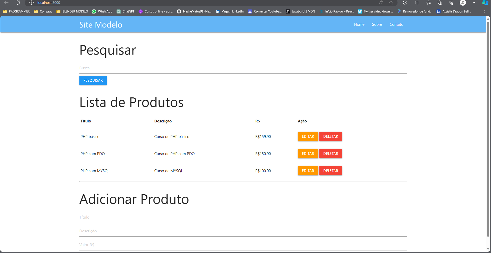

# Projeto - CRUD PHP BÁSICO

Uma aplicação feita com PHP, MySQL e Bootstrap do curso aprenda PHP na prática.

- O projeto

## 💻 Tecnologias utilizadas
As seguintes ferramentas foram utilizadas na construção do projeto:
- PHP
- MySQL
- Bootstrap
